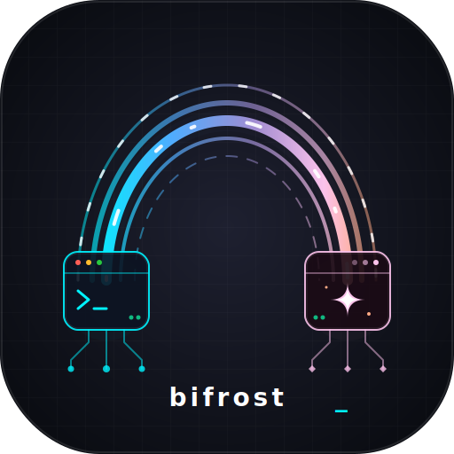

<p align="center">
  
</p>
<h1 align="center">Bifrost</h1>
<p align="center">国内外 AI 服务桥接 · 一键部署方案</p>
<p align="center">
  <a href="#快速开始">快速开始</a> ·
  <a href="docs/USAGE.md">使用指南</a> ·
  <a href="docs/VPN-SETUP.md">VPN 配置</a> ·
  <a href="docs/SECURITY.md">安全说明</a> ·
  <a href="docs/TROUBLESHOOTING.md">故障排查</a>
</p>

---

让中小企业（30–100 人）轻松使用 Claude Code、Codex CLI、OpenCode 等 AI 开发工具。

一条命令完成部署，无需手动配置。

## 为什么需要 Bifrost

国内开发者使用海外 AI 工具面临两个核心问题：**网络不可达** 和 **缺乏安全管控**。

Bifrost 通过 **双服务器架构** 解决：国内服务器负责安全接入与智能路由，海外服务器负责 AI API 网关，中间以加密隧道桥接。

## 架构

```
员工设备 (Claude Code / Codex CLI / OpenCode)
  │
  ▼ WireGuard VPN (加密隧道)
Server A · 国内 (腾讯云/阿里云/华为云)
  ├── Caddy        反向代理 + 自动 HTTPS
  ├── New API      AI API 网关 (30+ 供应商)
  ├── Mihomo       智能路由 (AI→代理 / 国内→直连 / 流媒体→拦截)
  └── Xray Client  VLESS+Reality 传输层
        │
        ▼ VLESS+Reality (流量伪装为正常 HTTPS)
Server B · 海外
  ├── Xray Server  VLESS+Reality 入站
  ├── 3x-ui        可视化管理面板
  └── Caddy        伪装站点
        │
        ▼ HTTPS
  Claude / GPT / Gemini / DeepSeek / Mistral ...
```

## 功能一览

| 类别 | 功能 |
|------|------|
| **部署** | 交互式一键安装，自动检测环境，支持全新/增量部署 |
| **AI 网关** | 30+ AI 供应商统一接入，API Key 管理，用量统计 |
| **安全** | VPN 零信任接入、SSH 加固、防火墙、fail2ban、内核加固 |
| **隐蔽** | VLESS+Reality 协议、DPI 防护、dest 池轮换、uTLS 指纹 |
| **路由** | Mihomo 规则路由、域名白名单、流媒体拦截、DNS 分流 |
| **运维** | 健康检查、自动保活、Watchdog、加密备份、组件更新 |
| **管理** | 多节点负载均衡、用户管理、入职/离职一键操作 |
| **诊断** | 全链路诊断、GFW 检测、JSON 报告导出 |

## 快速开始

### 前置条件

**Server A（国内）**

| 项目 | 最低要求 |
|------|----------|
| OS | Ubuntu 20.04+ / Debian 11+ |
| CPU | 2 核 |
| RAM | 4 GB |
| 存储 | 40 GB SSD |
| 网络 | 公网 IP，带宽 ≥ 10 Mbps |
| 推荐供应商 | 腾讯云、阿里云、华为云 |

**Server B（海外）**

| 项目 | 最低要求 |
|------|----------|
| OS | Ubuntu 20.04+ / Debian 11+ |
| CPU | 1 核 |
| RAM | 1 GB |
| 存储 | 20 GB SSD |
| 网络 | 公网 IP，带宽 ≥ 30 Mbps |
| 推荐供应商 | Bandwagon、RackNerd、DMIT |

**其他**

- 一个域名（用于 TLS 证书与流量伪装）

### 一键安装

SSH 登录到 Server A，执行：

```bash
curl -fsSL https://raw.githubusercontent.com/ZRainbow1275/bifrost/main/install.sh | bash
```

或克隆后本地执行：

```bash
git clone https://github.com/ZRainbow1275/bifrost.git
cd bifrost
chmod +x install.sh
./install.sh
```

安装脚本会引导你完成：
1. 系统环境检测与安全加固
2. VPN 网关部署 (WireGuard)
3. AI API 网关配置 (New API)
4. 代理隧道搭建 (Xray + Mihomo)
5. 域名白名单与流媒体拦截

### 员工接入

部署完成后，管理员为员工生成接入凭据：

```bash
./scripts/user-management.sh add <username>
```

员工按照 [客户端配置指南](docs/CLIENT-SETUP.md) 连接 VPN 即可使用 AI 服务。

## 项目结构

```
bifrost/
├── install.sh              # 主安装脚本
├── configs/                # 配置文件模板
│   ├── caddy/              # Caddy 反代配置
│   ├── mihomo/             # Mihomo 路由规则
│   ├── vpn/                # VPN 配置 (WireGuard/Firezone)
│   ├── xray/               # Xray 客户端/服务端配置
│   ├── anti-dpi/           # DPI 防护配置
│   ├── keepalive/          # 保活与 Watchdog
│   ├── whitelist/          # AI 域名白名单
│   └── ...
├── scripts/                # 功能脚本
│   ├── server-a.sh         # Server A 部署
│   ├── server-b.sh         # Server B 部署
│   ├── vpn.sh              # VPN 管理
│   ├── security.sh         # 安全加固
│   ├── diagnostics.sh      # 全链路诊断
│   ├── user-management.sh  # 用户管理
│   ├── backup.sh           # 加密备份/恢复
│   ├── update.sh           # 组件更新
│   └── ...
├── docs/                   # 文档
│   ├── USAGE.md            # 使用指南
│   ├── VPN-SETUP.md        # VPN 配置详解
│   ├── CLIENT-SETUP.md     # 客户端配置
│   ├── SECURITY.md         # 安全说明
│   └── TROUBLESHOOTING.md  # 故障排查
└── tests/                  # 测试
    └── test-in-docker.sh   # Docker 环境测试
```

## 支持的 AI 服务

Claude · GPT · Gemini · DeepSeek · Mistral · Grok · Qwen · Llama · Cohere · Yi · Moonshot · Zhipu · Baichuan · 更多...

通过 [New API](https://github.com/Calcium-Ion/new-api) 网关统一管理，支持 OpenAI 兼容格式。

## 安全设计

- **VPN 零信任**：员工必须通过 WireGuard VPN 接入，无 VPN 无法访问任何服务
- **流量伪装**：VLESS+Reality 协议使流量与正常 HTTPS 不可区分
- **DPI 防护**：dest 池管理 + 定时轮换 + uTLS 指纹 + Mux padding
- **域名白名单**：仅允许 AI API 域名，拒绝流媒体和其他用途
- **系统加固**：SSH 密钥认证、内核参数优化、fail2ban 防暴力破解

详见 [安全说明](docs/SECURITY.md)。

## 文档

| 文档 | 说明 |
|------|------|
| [使用指南](docs/USAGE.md) | 日常运维操作参考 |
| [VPN 配置](docs/VPN-SETUP.md) | WireGuard / Firezone / Headscale 配置详解 |
| [客户端配置](docs/CLIENT-SETUP.md) | 员工端配置步骤 |
| [安全说明](docs/SECURITY.md) | 安全架构与加固措施 |
| [故障排查](docs/TROUBLESHOOTING.md) | 常见问题与解决方案 |

## 许可证

本项目使用 [GPL-3.0](LICENSE) 许可证。

## 免责声明

本项目仅供学习和合法用途。使用者应确保其使用符合所在地区的法律法规。

- 作者不对因使用本项目造成的任何直接或间接损失承担责任
- 作者不对服务器安全事件、数据丢失或服务中断负责
- 作者没有义务提供技术支持、故障修复或问题回复
- 使用者须自行承担部署和运维风险

使用本项目即表示您同意上述条款。

---

<p align="center">
  <b>Bifrost</b> — 连接两个世界的桥梁
</p>
